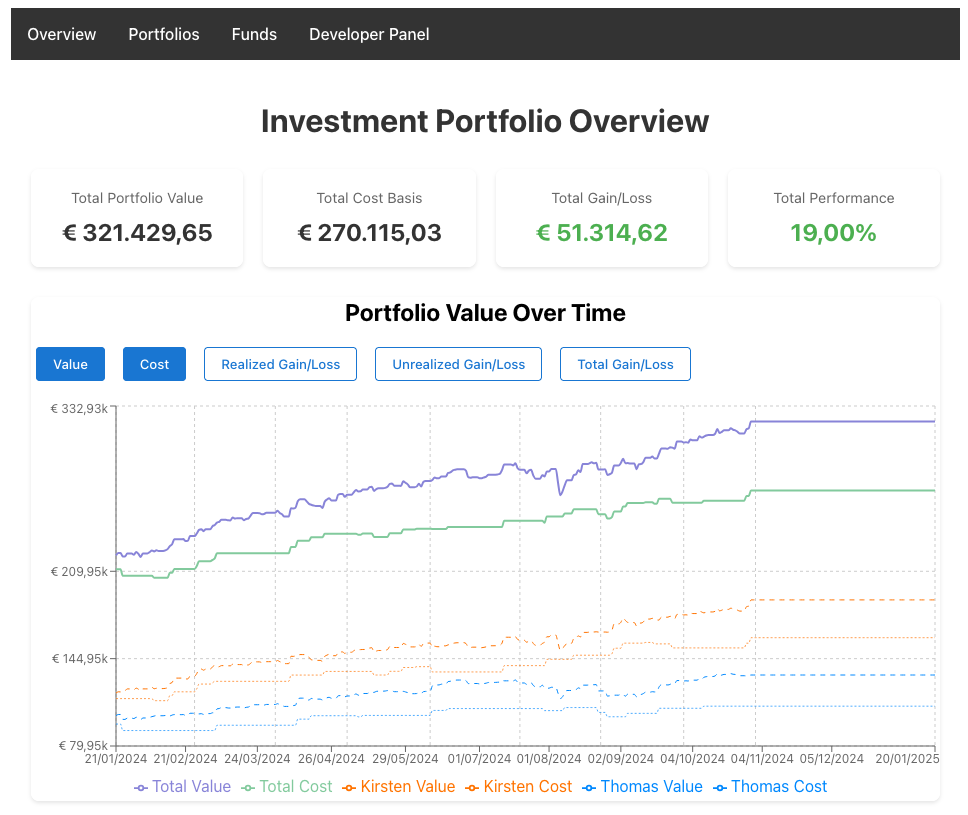

# Investment Portfolio Manager

The application provides core functionality for managing investment fund portfolios, including transaction tracking, dividend management, and historical price tracking. It supports both cash and stock dividend processing, CSV data imports, and basic portfolio performance visualization. The system is particularly suited for European investment funds, with built-in support for currency conversion and European number formatting.



This application was developed as an exploration of Large Language Model (LLM) assisted coding, specifically using Anthropic's Claude. The project aimed to solve a personal challenge of managing multiple Excel spreadsheets tracking various investment fund portfolios, their transactions, and dividend payments.

While functional for personal use, replacing my manual Excel tracking, it is not intended to compete with professional trading or portfolio management platforms as it lacks advanced features found in professional trading platforms, such as user authentication, real-time pricing, or complex trading tools.

## Development Modes: Docker or Local

This project supports two main ways to run and develop:

### 1. Docker (Recommended for most users)

- Run the entire stack in containers with a single command.
- Handles all dependencies and environment setup for you.
- See [docs/DOCKER.md](docs/DOCKER.md) for full instructions and environment details.

### 2. Local Development (For contributors and advanced users)

- Run the frontend and backend directly on your machine for rapid development and debugging.
- Supports a one-click full stack workflow in VSCode/Cursor, or manual setup if you prefer.
- See [docs/DEVELOPMENT.md](docs/DEVELOPMENT.md) for detailed local setup, environment variables, and database management.

---

## One-Click Full Stack Development (VSCode/Cursor)

This project is set up for a seamless development experience in VSCode or Cursor. You can set up, run, and debug both the frontend and backend with a single click using the pre-configured launch and task files.

**How it works:**

- The backend virtual environment is created automatically if missing, and all requirements (including dev requirements) are installed.
- The frontend dependencies are installed automatically if missing.
- The backend and frontend servers are started, and Chrome is launched for frontend debugging.
- The backend debug session always uses the correct Python interpreter from the venv.

**To use:**

1. Open the project in VSCode or Cursor.
2. Open the Run and Debug panel.
3. Select **"Debug Full Stack"** and click the green play button.
   - This will:
     - Set up and start the backend (with venv and requirements)
     - Set up and start the frontend
     - Launch Chrome and attach the debugger
4. You can set breakpoints in both frontend and backend code and debug seamlessly.

> **Tip:**
> You can also run the individual launch configs ("Debug Backend", "Start Frontend", or "Debug Frontend") if you only want to work on one part of the stack.

---

For advanced/manual local development, see [docs/DEVELOPMENT.md](docs/DEVELOPMENT.md).
For Docker-based setup and deployment, see [docs/DOCKER.md](docs/DOCKER.md).

---

## Running the Frontend Locally (Manual)

If you want to run the frontend manually (outside of VSCode/Cursor):

1. Open a terminal and navigate to the frontend directory:

   ```bash
   cd frontend
   npm install
   npm start
   ```

2. Open [http://localhost:3000](http://localhost:3000) in your browser.

---

## Running the Backend Locally (Manual)

If you want to run the backend manually (outside of VSCode/Cursor):

1. Open a terminal and navigate to the backend directory:

   ```bash
   cd backend
   python3.11 -m venv venv
   source venv/bin/activate
   pip install -r requirements.txt -r dev-requirements.txt
   python run.py
   ```

2. The backend will be available at [http://localhost:5000](http://localhost:5000).

---

## Documentation

### Architecture

- [Architecture](docs/ARCHITECTURE.md)
- [Data Models](docs/MODELS.md)

### Contributing

- [Contributing](docs/CONTRIBUTING.md)
- [Docker Setup](docs/DOCKER.md)

#### Frontend Development

- [CSS](docs/CSS.md)

#### Backend Development

- [Development Guide](docs/DEVELOPMENT.md)
- [Data Management](docs/DATA.md)

## Features

- Portfolio management with transaction tracking
- Cash and stock dividend processing
- Automated daily fund price updates
- Fund price history and currency conversion
- CSV import/export functionality
- System logging and monitoring
- Protected API endpoints for automated tasks

## License

Apache License, Version 2.0
