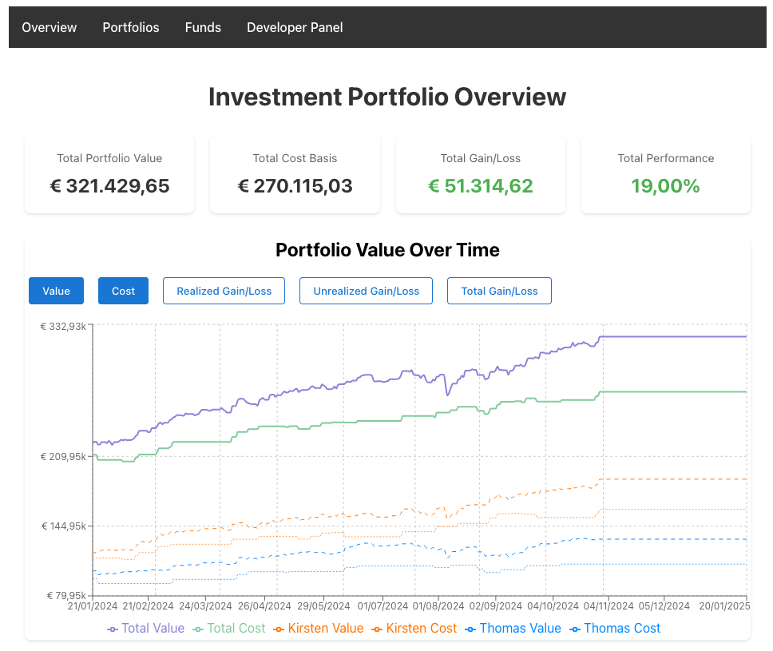

# Investment Portfolio Manager

The application provides core functionality for managing investment fund portfolios, including transaction tracking, dividend management, and historical price tracking. It supports both cash and stock dividend processing, CSV data imports, and basic portfolio performance visualization. The system is particularly suited for European investment funds, with built-in support for currency conversion and European number formatting.



This application was developed as an exploration of Large Language Model (LLM) assisted coding, specifically using Anthropic's Claude. The project aimed to solve a personal challenge of managing multiple Excel spreadsheets tracking various investment fund portfolios, their transactions, and dividend payments.

While functional for personal use, replacing my manual Excel tracking, it is not intended to compete with professional trading or portfolio management platforms as it lacks advanced features found in professional trading platforms, such as user authentication, real-time pricing, or complex trading tools.

## Quick Start

### Docker (Recommended)
```bash
git clone https://github.com/ndewijer/investment-portfolio-manager.git
cd investment-portfolio-manager
docker compose up -d
```
Access at http://localhost

No configuration needed! On first startup:
- Database migrations run automatically
- Frontend uses relative URLs that nginx proxies to the backend

### Local Development
**Prerequisites**: Go 1.26+, Node.js 24+, pnpm

```bash
# Backend
cd backend
cp .env.example .env
go run -ldflags "-X github.com/ndewijer/Investment-Portfolio-Manager/backend/internal/version.Version=$(cat VERSION)" ./cmd/server/main.go

# Frontend (new terminal)
cd frontend
pnpm install
pnpm start
```

## Tech Stack

| Component | Technology |
|-----------|-----------|
| **Backend** | Go 1.26, Chi router, pure Go SQLite |
| **Frontend** | React 19, Webpack 5, ApexCharts |
| **Database** | SQLite with materialized views |
| **Production** | Nginx (frontend) + Go binary (backend) |
| **Containers** | Docker Compose, multi-stage builds |
| **Testing** | Go test (80%+ coverage), Vitest, Playwright |
| **Code Quality** | golangci-lint (Go), Biome (JS) |

## Documentation
### Architecture
- [Architecture](docs/ARCHITECTURE.md)
- [Data Models](docs/MODELS.md)
- [Configuration](docs/CONFIGURATION.md)

### Features
- [IBKR Flex Integration Setup](docs/IBKR_SETUP.md)

### Contributing
- [Contributing](docs/CONTRIBUTING.md)

#### Frontend Development
- [CSS](docs/CSS.md)

#### Backend Development
- [Development Guide](docs/DEVELOPMENT.md)
- [Data Management](docs/DATA.md)

## Features
- Portfolio management with transaction tracking
- Cash and stock dividend processing
- Automated daily fund price updates
- IBKR Flex integration for automatic transaction imports
- Fund price history and currency conversion
- CSV import/export functionality
- System logging and monitoring
- Protected API endpoints for automated tasks
- Materialized views for optimized portfolio queries

## Upgrading from v1.x

See the [Migration Guide](docs/MIGRATION_GUIDE.md) for upgrading from the Python/Flask backend to the Go backend. The Python backend code is preserved at the [`v1.7.0-python-final`](../../tree/v1.7.0-python-final) tag.

## License
Apache License, Version 2.0
