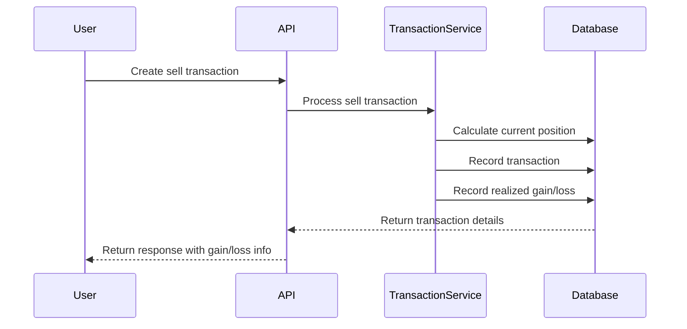

# Architecture Overview

## Frontend
- React 18 with Nginx in production
- Webpack dev server for development
- Context-based state management
- Responsive design with CSS modules

## Backend
- Flask/Gunicorn WSGI server
- SQLite database with SQLAlchemy ORM
- RESTful API design
- Service layer architecture pattern
- Comprehensive logging system

### Service Layer Pattern

The backend follows a service layer architecture to separate concerns and improve testability:

- **Routes** (`backend/app/routes/`): Handle HTTP requests/responses, input validation, and error formatting
- **Services** (`backend/app/services/`): Contain business logic, database operations, and complex workflows
- **Models** (`backend/app/models/`): Define database schema and relationships

**Benefits:**
- Business logic isolated from HTTP concerns
- Services can be tested independently without HTTP mocking
- Routes remain thin and focused on API contract
- Reusable logic across different endpoints

**Example:**
```python
# Route (thin)
@portfolio.route('/portfolio/<id>', methods=['DELETE'])
def delete_portfolio(id):
    return PortfolioService.delete_portfolio(id)

# Service (business logic)
class PortfolioService:
    @staticmethod
    def delete_portfolio(portfolio_id):
        # Check usage, validate, delete, log
        ...
```

## Automated Tasks
- Daily fund price updates (weekdays at 23:55)
- Weekly IBKR transaction imports (Tue-Sat between 06:30 and 08:30)
- Protected endpoints with API key authentication
- Scheduled tasks run with application context

## Security
- API key authentication for automated tasks
- Time-based token validation
- Protected endpoints for system tasks

## Project Structure
```
Investment-Portfolio-Manager/
├── backend/
│   ├── app/
│   │   ├── models/      # Database models
│   │   ├── routes/      # API endpoints
│   │   └── services/    # Business logic
│   ├── data/
│   │   ├── seed/        # Seed data
│   │   ├── exports/     # Exported data
│   │   └── imports/     # Import staging
│   └── tests/
└── frontend/
    ├── public/
    └── src/
        ├── components/  # Reusable components
        ├── pages/       # Page components
        ├── context/     # React contexts
        └── utils/       # Helper functions
```

## Key Components
- Portfolio Management System
- Transaction Processing
- Dividend Handling
- Price History Tracking
- Data Import/Export
- IBKR Flex Integration (v1.3.0+)
- Version Check & Feature Flags (v1.3.0+)
- Portfolio History Materialized View (v1.4.0+)

## Transaction and Gain/Loss Tracking

### Overview
The system tracks both realized and unrealized gains/losses for investments:
- Realized gains/losses are recorded when selling investments
- Unrealized gains/losses are calculated based on current market value vs. cost basis
- Historical performance data is maintained even after shares are sold and reinvested

### Key Components

#### RealizedGainLoss Model
- Tracks gains/losses from selling investments
- Maintains direct relationship with transactions via `transaction_id`
- Records:
  - Cost basis of sold shares
  - Sale proceeds
  - Realized gain/loss amount
  - Transaction date and details

#### Transaction Processing
When processing sell transactions:
1. Calculate current position and average cost
2. Record the sale transaction
3. Calculate and store realized gain/loss
4. Maintain relationship between transaction and realized gain

#### Portfolio Calculations
Portfolio values include:
- Current market value of holdings
- Total cost basis
- Unrealized gains/losses on current positions
- Realized gains/losses from past sales
- Total gains/losses (realized + unrealized)

### Example Flow


### Performance Considerations
- Direct foreign key relationship between Transaction and RealizedGainLoss
- Indexed queries for efficient gain/loss calculations
- Cached calculations where appropriate

## IBKR Flex Integration (v1.3.0+)

### Overview
The system includes integration with Interactive Brokers (IBKR) Flex Web Service to automatically import stock and ETF transactions. This feature streamlines the process of keeping portfolios up to date with actual brokerage transactions.

### Components

#### IBKR Flex Service
- `backend/app/services/ibkr_flex_service.py`
- Handles API communication with IBKR Flex Web Service
- Manages token encryption/decryption using Fernet
- Implements 24-hour response caching to avoid duplicate API calls
- Parses XML responses into transaction records

#### IBKR Transaction Processing
- `backend/app/services/ibkr_transaction_service.py`
- Validates user allocations (must sum to 100%)
- Creates or updates Fund records based on IBKR data
- Generates Transaction records across multiple portfolios
- Handles dividend matching to existing Dividend records

#### API Routes
- `backend/app/routes/ibkr_routes.py`
- Configuration management (`/api/ibkr/config`)
- Manual import trigger (`/api/ibkr/import`)
- Inbox management (`/api/ibkr/inbox`)
- Transaction allocation (`/api/ibkr/inbox/:id/allocate`)
- Dividend matching (`/api/ibkr/inbox/:id/match-dividend`)

#### Database Tables
- `ibkr_config`: Stores encrypted token and query configuration
- `ibkr_transaction`: Raw imported transactions (audit trail)
- `ibkr_transaction_allocation`: Tracks portfolio allocations
- `ibkr_import_cache`: Caches API responses for 24 hours

### Workflow

1. **Configuration**: User provides Flex Token and Query ID via UI
2. **Import**: System fetches transactions (manual or weekly scheduled)
3. **Inbox**: Imported transactions appear as "pending"
4. **Allocation**: User specifies how to split each transaction across portfolios
5. **Processing**: System creates Transaction records and updates portfolio holdings
6. **Management**: Users can view, modify, or unallocate processed transactions

### Transaction Status Flow

```
┌─────────────┐
│   Import    │ → IBKRTransaction created
└──────┬──────┘
       │
       ▼
┌─────────────┐
│   pending   │ ← Appears in IBKR Inbox "Pending" tab
└──────┬──────┘
       │
       ├─────► Allocate to portfolio(s)
       │
       ▼
┌─────────────┐    ┌──────────┐
│  processed  │ or │ ignored  │
└──────┬──────┘    └──────────┘
       │
       │ View/Modify/Unallocate
       │ (or delete all portfolio transactions)
       │
       ▼
┌─────────────┐
│   pending   │ ← Auto-revert: ready for reallocation
└─────────────┘
```

### IBKR Transaction Lifecycle Management

**Auto-Revert Mechanism:**
When portfolio transactions created from IBKR allocations are deleted:
- **Partial deletion**: If IBKR transaction was allocated to multiple portfolios and only some are deleted, status remains "processed"
- **Complete deletion**: If all portfolio transactions are deleted, IBKR transaction automatically reverts to "pending" status and reappears in inbox

**Management Operations:**
- **View Details** (`GET /ibkr/inbox/:id/allocations`): See how transaction was allocated across portfolios
- **Modify** (`PUT /ibkr/inbox/:id/allocations`): Adjust allocation percentages without recreating transactions
- **Unallocate** (`POST /ibkr/inbox/:id/unallocate`): Remove all allocations and revert to pending status

**Cascade Delete Behavior:**
```
Transaction (deleted by user)
  ↓ CASCADE (database)
IBKRTransactionAllocation (auto-deleted)
  ↓ APPLICATION LOGIC
IBKRTransaction.status (reverted to pending if last allocation)
```

For detailed implementation, see [IBKR Transaction Lifecycle Documentation](IBKR_TRANSACTION_LIFECYCLE.md)

### Security
- IBKR Flex tokens are encrypted at rest using Fernet encryption
- Encryption key stored in environment variable `IBKR_ENCRYPTION_KEY`
- Tokens are write-only in the UI (never displayed after saving)
- All IBKR operations are logged for audit trail

### Caching Strategy
- API responses cached for 24 hours
- Cache key includes query ID and date
- Expired cache entries automatically cleaned up
- Manual imports can bypass cache for testing

### Scheduled Tasks
- Weekly import runs Tuesday - Saturday between 06:30 and 08:30 (if auto-import enabled)
- Uses same workflow as manual imports
- Results logged for monitoring

See [IBKR Setup Guide](IBKR_SETUP.md) for detailed configuration instructions.

## Portfolio History Materialized View (v1.4.0+)

### Overview
The materialized view feature dramatically improves portfolio history query performance by pre-calculating and caching daily portfolio values. This optimization reduces query time from seconds to milliseconds, providing a significantly improved user experience for historical data analysis.

### Performance Impact
- **Before**: ~8 seconds for 5 years of daily history (on-demand calculation)
- **After**: ~50ms for 5 years of daily history (cached data)
- **Improvement**: 160x faster query performance

### Components

#### PortfolioHistoryMaterialized Model
- `backend/app/models.py`
- Stores pre-calculated daily portfolio metrics
- Fields: portfolio_id, date, value, cost, realized_gain, unrealized_gain, total_dividends, total_sale_proceeds, total_original_cost, total_gain_loss, is_archived, calculated_at
- Indexed on (portfolio_id, date) for efficient range queries
- Unique constraint on (portfolio_id, date)
- CASCADE delete when portfolio is deleted

#### PortfolioHistoryMaterializedService
- `backend/app/services/portfolio_history_materialized_service.py`
- Manages materialized view lifecycle
- Key methods:
  - `check_materialized_coverage()` - Determines if date range is fully cached
  - `get_materialized_history()` - Retrieves cached portfolio history
  - `materialize_portfolio_history()` - Calculates and stores portfolio data
  - `invalidate_materialized_history()` - Removes stale cache entries
  - `materialize_all_portfolios()` - Batch materialization

#### Smart Query Router
- Integrated into `PortfolioService.get_portfolio_history()`
- Automatically detects complete materialized coverage
- Routes to fast path (materialized) or slow path (on-demand) transparently
- No API changes required - optimization is invisible to consumers

#### Database Table
```sql
CREATE TABLE portfolio_history_materialized (
    id TEXT PRIMARY KEY,
    portfolio_id TEXT NOT NULL,
    date TEXT NOT NULL,  -- YYYY-MM-DD format
    value REAL NOT NULL,
    cost REAL NOT NULL,
    realized_gain REAL NOT NULL,
    unrealized_gain REAL NOT NULL,
    total_dividends REAL NOT NULL,
    total_sale_proceeds REAL NOT NULL,
    total_original_cost REAL NOT NULL,
    total_gain_loss REAL NOT NULL,
    is_archived INTEGER NOT NULL,
    calculated_at TIMESTAMP DEFAULT CURRENT_TIMESTAMP,

    FOREIGN KEY (portfolio_id) REFERENCES portfolio(id) ON DELETE CASCADE,
    UNIQUE(portfolio_id, date)
);

CREATE INDEX idx_portfolio_history_mat_portfolio_date
    ON portfolio_history_materialized(portfolio_id, date);
CREATE INDEX idx_portfolio_history_mat_date
    ON portfolio_history_materialized(date);
```

### Workflow

1. **Initial Setup**: Run `flask materialize-history` to populate cache
2. **Query Optimization**: Subsequent history queries use cached data automatically
3. **Automatic Invalidation**: Cache invalidated when source data changes:
   - Transaction created/updated/deleted → invalidates from transaction.date forward
   - Dividend created/updated/deleted → invalidates from ex_dividend_date forward
   - Fund price updated → invalidates for all portfolios holding that fund
4. **Recalculation**: Next query recalculates missing data and updates cache

### CLI Commands

- `flask materialize-history` - Populate materialized view for all portfolios
- `flask materialize-history --portfolio-id=<id>` - Materialize specific portfolio
- `flask materialize-history --force` - Force recalculation of existing data
- `flask materialized-stats` - View cache statistics and coverage
- `flask invalidate-materialized-history --portfolio-id=<id> --from-date=YYYY-MM-DD` - Manual invalidation

### Cache Invalidation Strategy

The system uses **application-level triggers** for cache invalidation:

```python
# In TransactionService.create_transaction()
transaction = Transaction(...)
db.session.commit()

# Automatically invalidate materialized view
PortfolioHistoryMaterializedService.invalidate_from_transaction(transaction)
```

**Advantages:**
- Easy to test and debug
- Async recalculation possible
- Full control over invalidation logic
- Visible in application logs

### Coverage Detection

The service intelligently detects cache coverage:
- **Complete Coverage**: All requested dates are materialized → use fast path
- **No Coverage**: No materialized data exists → use on-demand calculation
- **Partial Coverage**: Some dates materialized → currently falls back to on-demand (future: hybrid approach)

### Storage Requirements

Typical storage per portfolio:
- ~1,500 days (4 years of history) = 150KB per portfolio
- 10 portfolios = 1.5MB total
- Very reasonable for SQLite

### Maintenance

**Recommended Schedule:**
- **Automatic**: Cache invalidated on writes (transactions, dividends, prices)
- **Weekly**: Run `flask materialize-history --force` via cron to fill any gaps
- **Monitoring**: Check `flask materialized-stats` for coverage metrics

### Future Enhancements

1. **Background Jobs**: Async recalculation via Celery/RQ
2. **Incremental Updates**: Only recalculate affected date ranges
3. **Hybrid Queries**: Combine materialized and on-demand for partial coverage
4. **Real-time Push**: WebSocket updates when recalculation completes
5. **Compression**: Store daily deltas instead of full snapshots

See [MATERIALIZED_VIEW_IMPLEMENTATION.md](../MATERIALIZED_VIEW_IMPLEMENTATION.md) for detailed implementation guide.

## Version Check & Feature Flags (v1.3.0+)

### Overview
The system includes a version checking mechanism that compares the application version with the database schema version. This allows the frontend to gracefully handle situations where migrations haven't been run yet.

### API Endpoint
- `GET /api/system/version` - Returns version and feature availability information

### Response Format
```json
{
  "app_version": "1.3.0",
  "db_version": "1.1.2",
  "features": {
    "ibkr_integration": false,
    "realized_gain_loss": true,
    "exclude_from_overview": true
  },
  "migration_needed": true,
  "migration_message": "Database schema (v1.1.2) is behind application version (v1.3.0). Run 'flask db upgrade' to enable new features."
}
```

### Feature Flags by Version
- **v1.1.0+**: `exclude_from_overview` - Portfolio can be excluded from overview
- **v1.1.1+**: `realized_gain_loss` - Realized gain/loss tracking
- **v1.3.0+**: `ibkr_integration` - IBKR Flex integration

### Frontend Integration
The frontend should:
1. Call `/api/system/version` on app initialization
2. Store feature flags in global state/context
3. Conditionally render features based on flags
4. Display migration message banner if `migration_needed` is true
5. Hide/disable unavailable features gracefully

### Example Usage
```javascript
// Check version on app load
const versionInfo = await api.get('/system/version');

if (!versionInfo.features.ibkr_integration) {
  // Hide IBKR menu items
  // Show upgrade banner
}
```

### Health Check
- `GET /api/system/health` - Basic health check endpoint
- Returns database connection status
- Useful for monitoring and deployment verification

---

**Last Updated**: 2026-01-11 (Version 1.4.0)
**Maintained By**: @ndewijer
