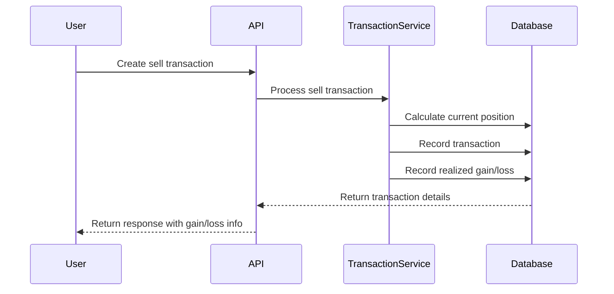

# Architecture Overview

## Frontend

- React 18 with Nginx in production
- Webpack dev server for development
- Context-based state management
- Responsive design with CSS modules

## Backend

- Flask/Gunicorn WSGI server
- SQLite database with SQLAlchemy ORM
- RESTful API design
- Comprehensive logging system

## Automated Tasks

- Daily fund price updates (weekdays at 23:55)
- Protected endpoints with API key authentication
- Scheduled tasks run with application context

## Security

- API key authentication for automated tasks
- Time-based token validation
- Protected endpoints for system tasks

## Project Structure

```tree
Investment-Portfolio-Manager/
├── backend/
│   ├── app/
│   │   ├── models/      # Database models
│   │   ├── routes/      # API endpoints
│   │   └── services/    # Business logic
│   ├── data/
│   │   ├── seed/        # Seed data
│   │   ├── exports/     # Exported data
│   │   └── imports/     # Import staging
│   └── tests/
└── frontend/
    ├── public/
    └── src/
        ├── components/  # Reusable components
        ├── pages/       # Page components
        ├── context/     # React contexts
        └── utils/       # Helper functions
```

## Key Components

- Portfolio Management System
- Transaction Processing
- Dividend Handling
- Price History Tracking
- Data Import/Export

## Transaction and Gain/Loss Tracking

### Overview

The system tracks both realized and unrealized gains/losses for investments:

- Realized gains/losses are recorded when selling investments
- Unrealized gains/losses are calculated based on current market value vs. cost basis
- Historical performance data is maintained even after shares are sold and reinvested

### Key Components

#### RealizedGainLoss Model

- Tracks gains/losses from selling investments
- Maintains direct relationship with transactions via `transaction_id`
- Records:
  - Cost basis of sold shares
  - Sale proceeds
  - Realized gain/loss amount
  - Transaction date and details

#### Transaction Processing

When processing sell transactions:

1. Calculate current position and average cost
2. Record the sale transaction
3. Calculate and store realized gain/loss
4. Maintain relationship between transaction and realized gain

#### Portfolio Calculations

Portfolio values include:

- Current market value of holdings
- Total cost basis
- Unrealized gains/losses on current positions
- Realized gains/losses from past sales
- Total gains/losses (realized + unrealized)

### Example Flow



### Performance Considerations

- Direct foreign key relationship between Transaction and RealizedGainLoss
- Indexed queries for efficient gain/loss calculations
- Cached calculations where appropriate
