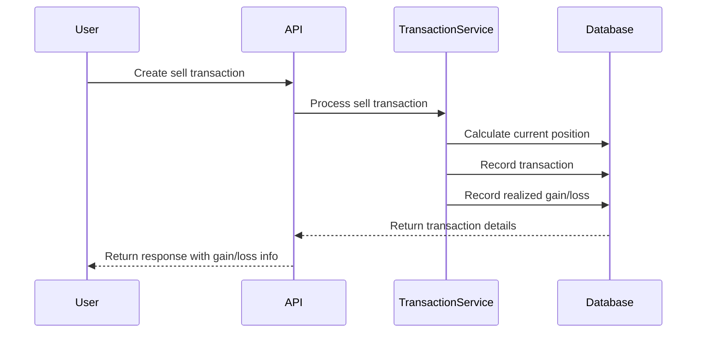

# Architecture Overview

## Frontend
- React 19 with Nginx in production
- Webpack dev server for development
- Context-based state management
- Responsive design with CSS variables and component-scoped CSS
- ApexCharts (vanilla) for interactive time-series charts

## Backend
- Go HTTP server using [Chi](https://github.com/go-chi/chi) router
- SQLite database with pure Go driver (`modernc.org/sqlite`)
- RESTful API design
- Handler -> Service -> Repository layered architecture
- Structured logging system with database-configurable levels

### Layered Architecture

The backend follows a Handler -> Service -> Repository pattern to separate concerns and improve testability:

```
HTTP Request → Router → Handler → Service → Repository → Database
                ↓
          Middleware (request ID injection, real IP extraction, logging, CORS, panic recovery, UUID validation, API key authentication)
```

- **Handlers** (`backend/internal/api/handlers/`): Parse HTTP requests, call services, write responses. No business logic.
- **Services** (`backend/internal/service/`): Business logic, validation, orchestration. Services may call other services and multiple repositories. Own transaction boundaries for write operations.
- **Repositories** (`backend/internal/repository/`): Data access. Each repository maps to one database table/domain. Accepts `*sql.DB` or `*sql.Tx` so services can compose multiple repository calls in a single transaction.
- **Middleware** (`backend/internal/api/middleware/`): Cross-cutting concerns: request logging, CORS, panic recovery, UUID path parameter validation, API key authentication.

**Benefits:**
- Business logic isolated from HTTP concerns
- Services can be tested independently with real database calls (no mocks)
- Handlers remain thin and focused on API contract
- Reusable logic across different endpoints
- Write operations follow a consistent pattern: begin transaction, call repositories with `*sql.Tx`, commit or rollback

**Example:**
```go
// Handler (thin) — internal/api/handlers/portfolios.go
func (h *PortfolioHandler) DeletePortfolio(w http.ResponseWriter, r *http.Request) {
    id := chi.URLParam(r, "portfolioId")
    err := h.portfolioService.DeletePortfolio(r.Context(), id)
    if err != nil {
        response.HandleServiceError(w, err)
        return
    }
    w.WriteHeader(http.StatusNoContent)
}

// Service (business logic) — internal/service/portfolio_service.go
func (s *PortfolioService) DeletePortfolio(ctx context.Context, id string) error {
    // Check usage, validate, delete, log
    // ...
}
```

### Middleware Stack

The Chi router applies middleware in order. The backend uses:

1. **Request ID** — Injects a unique request ID into each request context and response header
2. **Real IP** — Extracts the client's real IP from proxy headers
3. **Request Logger** — Logs method, path, status, and duration for every request
4. **CORS** — Handles cross-origin requests based on `CORS_ALLOWED_ORIGINS` or `DOMAIN` env vars
5. **Panic Recovery** — Catches panics and returns 500 instead of crashing
6. **UUID Validation** — Validates UUID path parameters before handlers execute
7. **API Key Auth** — Protects specific endpoints (e.g., scheduled price updates) behind `X-API-Key` header

## Automated Tasks
- Daily fund price updates (weekdays at 00:55 UTC)
- Weekly IBKR transaction imports (Tue-Sat between 05:30 and 07:30 UTC, retries hourly)
- Both use `SkipIfStillRunning` to prevent overlap and have 15-minute timeouts
- Protected endpoints with API key authentication
- Scheduled tasks run in-process via `robfig/cron`

## Security
- API key authentication for automated tasks
- IBKR credentials encrypted at rest using Fernet symmetric encryption
- Encryption key resolved in priority order: `IBKR_ENCRYPTION_KEY` env var -> `data/.ibkr_encryption_key` file -> auto-generated on first run
- Protected endpoints for system tasks

## Project Structure
```
Investment-Portfolio-Manager/
├── backend/
│   ├── cmd/server/main.go          # Entry point — wires dependencies, starts server
│   ├── internal/
│   │   ├── api/
│   │   │   ├── router.go           # Route definitions (Chi)
│   │   │   ├── handlers/           # HTTP handlers, one file per domain
│   │   │   ├── middleware/          # CORS, logging, UUID validation, API key auth
│   │   │   ├── request/            # Request parsing types, one file per domain
│   │   │   └── response/           # Shared response helpers
│   │   ├── model/                  # Domain model types
│   │   ├── service/                # Business logic, one file per domain
│   │   ├── repository/             # Database access, one file per domain
│   │   ├── database/
│   │   │   ├── database.go         # Connection setup
│   │   │   ├── migrate.go          # Migration runner
│   │   │   └── migrations/         # Goose SQL migration files
│   │   ├── config/                 # Environment-based configuration
│   │   ├── logging/                # Structured logging with DB-configurable levels
│   │   ├── validation/             # Input validation helpers
│   │   ├── apperrors/              # Typed application errors
│   │   ├── yahoo/                  # Yahoo Finance price client
│   │   ├── ibkr/                   # IBKR Flex report client
│   │   ├── version/                # Build-time version injection
│   │   └── testutil/               # Shared test helpers and DB setup
│   └── data/
│       └── portfolio_manager.db    # SQLite database (gitignored)
└── frontend/
    ├── public/
    └── src/
        ├── components/  # Reusable components
        ├── pages/       # Page components
        ├── context/     # React contexts
        └── utils/       # Helper functions
```

## Key Design Decisions

### Pure Go SQLite

Uses `modernc.org/sqlite` — a pure Go SQLite implementation requiring no CGO. This simplifies cross-compilation and Docker builds at the cost of slightly lower performance than CGO-based drivers. For a single-user portfolio app, this is the right trade-off.

### Repository + Service Pattern

Repositories handle raw SQL. Services own the business rules and transaction boundaries. This keeps SQL out of handlers and makes services testable with real database calls (no mocks).

Write operations follow a consistent pattern:
1. Service begins transaction
2. Service calls one or more repositories with the `*sql.Tx`
3. Service commits or rolls back

## Key Components
- Portfolio Management System
- Transaction Processing
- Dividend Handling
- Price History Tracking
- Data Import/Export
- IBKR Flex Integration (v1.3.0+)
- Version Check & Feature Flags (v1.3.0+)
- Portfolio History Materialized View (v1.4.0+)
- Interactive Charts with ApexCharts (v2.0.0+)

## Charting (v2.0.0+)

### Overview
Portfolio performance is visualised using **ApexCharts v5** (vanilla JS, not the React wrapper) via the `ValueChart` component. Using the vanilla library directly avoids lifecycle conflicts with React 19 Strict Mode's double-effect invocation.

### ValueChart Component
- **File**: `frontend/src/components/ValueChart.js`
- Renders a multi-line time-series chart for portfolio metrics (value, cost, realized/unrealized gains)
- Built with vanilla `ApexCharts` managed via `useEffect` with a single stable DOM container
- Dark/light theme automatically passed from `ThemeContext` via `theme.mode`
- Mobile fullscreen: CSS-based (`position: fixed`) expansion that keeps the chart instance alive

### Chart Data Flow
```
API (portfolio/history)
  ↓ useChartData hook (progressive loading)
  ↓ formatChartData() → [{date, totalValue, totalCost, ...}]
  ↓ getChartLines()   → [{dataKey, name, color, strokeWidth, ...}]
  ↓ ValueChart        → series [{name, data: [[timestamp, value], ...]}]
  ↓ ApexCharts instance (vanilla)
```

### Zoom & Progressive Loading
`ValueChart` receives an `onZoomChange` callback from `useChartData`. When the user zooms, ApexCharts fires a `zoomed` event with timestamp bounds; the component converts these to array indices and calls `onZoomChange({ isZoomed, xDomain })`. `useChartData` then fetches additional historical data if the view approaches the edges of the loaded range.

## Transaction and Gain/Loss Tracking

### Overview
The system tracks both realized and unrealized gains/losses for investments:
- Realized gains/losses are recorded when selling investments
- Unrealized gains/losses are calculated based on current market value vs. cost basis
- Historical performance data is maintained even after shares are sold and reinvested

### Key Components

#### RealizedGainLoss Model
- Tracks gains/losses from selling investments
- Maintains direct relationship with transactions via `transaction_id`
- Records:
  - Cost basis of sold shares
  - Sale proceeds
  - Realized gain/loss amount
  - Transaction date and details

#### Transaction Processing
When processing sell transactions:
1. Calculate current position and average cost
2. Record the sale transaction
3. Calculate and store realized gain/loss
4. Maintain relationship between transaction and realized gain

#### Portfolio Calculations
Portfolio values include:
- Current market value of holdings
- Total cost basis
- Unrealized gains/losses on current positions
- Realized gains/losses from past sales
- Total gains/losses (realized + unrealized)

### Example Flow

```mermaid
sequenceDiagram
participant User
participant API
participant TransactionService
participant Database
User->>API: Create sell transaction
API->>TransactionService: Process sell transaction
TransactionService->>Database: Calculate current position
TransactionService->>Database: Record transaction
TransactionService->>Database: Record realized gain/loss
Database-->>API: Return transaction details
API-->>User: Return response with gain/loss info
```

### Performance Considerations
- Direct foreign key relationship between Transaction and RealizedGainLoss
- Indexed queries for efficient gain/loss calculations
- Cached calculations where appropriate

## IBKR Flex Integration (v1.3.0+)

### Overview
The system includes integration with Interactive Brokers (IBKR) Flex Web Service to automatically import stock and ETF transactions. This feature streamlines the process of keeping portfolios up to date with actual brokerage transactions.

### Components

#### IBKR Flex Client
- `backend/internal/ibkr/` package
- Handles API communication with IBKR Flex Web Service
- Manages token encryption/decryption using Fernet
- Implements 24-hour response caching to avoid duplicate API calls
- Parses XML responses into transaction records

#### IBKR Transaction Processing
- `backend/internal/service/ibkr_transaction_service.go`
- Validates user allocations (must sum to 100%)
- Creates or updates Fund records based on IBKR data
- Generates Transaction records across multiple portfolios
- Handles dividend matching to existing Dividend records

#### API Handlers
- `backend/internal/api/handlers/ibkr.go`
- Configuration management (`/api/ibkr/config`)
- Manual import trigger (`/api/ibkr/import`)
- Inbox management (`/api/ibkr/inbox`)
- Transaction allocation (`/api/ibkr/inbox/:id/allocate`)
- Dividend matching (`/api/ibkr/inbox/:id/match-dividend`)

#### Database Tables
- `ibkr_config`: Stores encrypted token and query configuration
- `ibkr_transaction`: Raw imported transactions (audit trail)
- `ibkr_transaction_allocation`: Tracks portfolio allocations
- `ibkr_import_cache`: Caches API responses for 24 hours

### Workflow

1. **Configuration**: User provides Flex Token and Query ID via UI
2. **Import**: System fetches transactions (manual or weekly scheduled)
3. **Inbox**: Imported transactions appear as "pending"
4. **Allocation**: User specifies how to split each transaction across portfolios
5. **Processing**: System creates Transaction records and updates portfolio holdings
6. **Management**: Users can view, modify, or unallocate processed transactions

### Transaction Status Flow

```
┌─────────────┐
│   Import    │ → IBKRTransaction created
└──────┬──────┘
       │
       ▼
┌─────────────┐
│   pending   │ ← Appears in IBKR Inbox "Pending" tab
└──────┬──────┘
       │
       ├─────► Allocate to portfolio(s)
       │
       ▼
┌─────────────┐    ┌──────────┐
│  processed  │ or │ ignored  │
└──────┬──────┘    └──────────┘
       │
       │ View/Modify/Unallocate
       │ (or delete all portfolio transactions)
       │
       ▼
┌─────────────┐
│   pending   │ ← Auto-revert: ready for reallocation
└─────────────┘
```

### IBKR Transaction Lifecycle Management

**Auto-Revert Mechanism:**
When portfolio transactions created from IBKR allocations are deleted:
- **Partial deletion**: If IBKR transaction was allocated to multiple portfolios and only some are deleted, status remains "processed"
- **Complete deletion**: If all portfolio transactions are deleted, IBKR transaction automatically reverts to "pending" status and reappears in inbox

**Management Operations:**
- **View Details** (`GET /ibkr/inbox/:id/allocations`): See how transaction was allocated across portfolios
- **Modify** (`PUT /ibkr/inbox/:id/allocations`): Adjust allocation percentages without recreating transactions
- **Unallocate** (`POST /ibkr/inbox/:id/unallocate`): Remove all allocations and revert to pending status

**Cascade Delete Behavior:**
```
Transaction (deleted by user)
  ↓ CASCADE (database)
IBKRTransactionAllocation (auto-deleted)
  ↓ APPLICATION LOGIC
IBKRTransaction.status (reverted to pending if last allocation)
```

For detailed implementation, see [IBKR Transaction Lifecycle Documentation](IBKR_TRANSACTION_LIFECYCLE.md)

### Security
- IBKR Flex tokens are encrypted at rest using Fernet encryption
- Encryption key resolved in priority order: `IBKR_ENCRYPTION_KEY` env var -> `data/.ibkr_encryption_key` file -> auto-generated on first run
- Tokens are write-only in the UI (never displayed after saving)
- All IBKR operations are logged for audit trail

### Caching Strategy
- API responses cached for 24 hours
- Cache key includes query ID and date
- Expired cache entries automatically cleaned up
- Manual imports can bypass cache for testing

### Scheduled Tasks
- Weekly import runs Tuesday - Saturday between 05:30 and 07:30 UTC (if auto-import enabled)
- Uses same workflow as manual imports
- Both use `SkipIfStillRunning` to prevent overlap and have 15-minute timeouts
- Results logged for monitoring

See [IBKR Setup Guide](IBKR_SETUP.md) for detailed configuration instructions.

## Portfolio History Materialized View (v1.4.0+)

### Overview
The materialized view feature dramatically improves portfolio history query performance by pre-calculating and caching daily portfolio values. This optimization reduces query time from seconds to milliseconds, providing a significantly improved user experience for historical data analysis.

### Performance Impact
- **Before**: ~8 seconds for 5 years of daily history (on-demand calculation)
- **After**: ~50ms for 5 years of daily history (cached data)
- **Improvement**: 160x faster query performance

### Components

#### PortfolioHistoryMaterialized Model
- `backend/internal/model/portfolio_history_materialized.go`
- Stores pre-calculated daily portfolio metrics
- Database fields (snake_case): portfolio_id, date, value, cost, realized_gain, unrealized_gain, total_dividends, total_sale_proceeds, total_original_cost, total_gain_loss, is_archived, calculated_at
- API response fields (camelCase): totalValue, totalCost, totalRealizedGainLoss, totalUnrealizedGainLoss, totalDividends, totalSaleProceeds, totalOriginalCost, totalGainLoss, isArchived
- Indexed on (portfolio_id, date) for efficient range queries
- Unique constraint on (portfolio_id, date)
- CASCADE delete when portfolio is deleted

**Note on Field Naming**: The internal database and Go code use snake_case, while the API responses use camelCase (following JavaScript conventions). The conversion happens at the API boundary in the service layer's JSON serialization.

#### MaterializedService
- `backend/internal/service/materialized_service.go`
- Manages materialized view lifecycle
- Key methods:
  - `CheckMaterializedCoverage()` - Determines if date range is fully cached
  - `GetMaterializedHistory()` - Retrieves cached portfolio history
  - `MaterializePortfolioHistory()` - Calculates and stores portfolio data
  - `InvalidateMaterializedHistory()` - Removes stale cache entries
  - `MaterializeAllPortfolios()` - Batch materialization

#### Smart Query Router
- Integrated into portfolio service's history endpoint
- Automatically detects complete materialized coverage
- Routes to fast path (materialized) or slow path (on-demand) transparently
- No API changes required - optimization is invisible to consumers

#### Database Table
```sql
CREATE TABLE portfolio_history_materialized (
    id TEXT PRIMARY KEY,
    portfolio_id TEXT NOT NULL,
    date TEXT NOT NULL,  -- YYYY-MM-DD format
    value REAL NOT NULL,
    cost REAL NOT NULL,
    realized_gain REAL NOT NULL,
    unrealized_gain REAL NOT NULL,
    total_dividends REAL NOT NULL,
    total_sale_proceeds REAL NOT NULL,
    total_original_cost REAL NOT NULL,
    total_gain_loss REAL NOT NULL,
    is_archived INTEGER NOT NULL,
    calculated_at TIMESTAMP DEFAULT CURRENT_TIMESTAMP,

    FOREIGN KEY (portfolio_id) REFERENCES portfolio(id) ON DELETE CASCADE,
    UNIQUE(portfolio_id, date)
);

CREATE INDEX idx_portfolio_history_mat_portfolio_date
    ON portfolio_history_materialized(portfolio_id, date);
CREATE INDEX idx_portfolio_history_mat_date
    ON portfolio_history_materialized(date);
```

### Workflow

1. **Automatic on Startup**: Migrations run automatically via Goose on server start, creating the table if needed
2. **Query Optimization**: History queries use cached data automatically when available
3. **Automatic Invalidation**: Cache invalidated when source data changes:
   - Transaction created/updated/deleted -> invalidates from transaction.date forward
   - Dividend created/updated/deleted -> invalidates from ex_dividend_date forward
   - Fund price updated -> invalidates for all portfolios holding that fund
4. **Recalculation**: Next query recalculates missing data and updates cache

### Cache Invalidation Strategy

The system uses **application-level triggers** for cache invalidation:

```go
// In TransactionService.CreateTransaction()
// After committing the transaction:
s.materializedService.InvalidateFromDate(ctx, portfolioID, transaction.Date)
```

**Advantages:**
- Easy to test and debug
- Full control over invalidation logic
- Visible in application logs
- Services own the invalidation responsibility

### Coverage Detection

The service intelligently detects cache coverage:
- **Complete Coverage**: All requested dates are materialized -> use fast path
- **No Coverage**: No materialized data exists -> use on-demand calculation
- **Partial Coverage**: Some dates materialized -> currently falls back to on-demand (future: hybrid approach)

### Storage Requirements

Typical storage per portfolio:
- ~1,500 days (4 years of history) = 150KB per portfolio
- 10 portfolios = 1.5MB total
- Very reasonable for SQLite

### Maintenance

**Recommended Schedule:**
- **Automatic**: Cache invalidated on writes (transactions, dividends, prices)
- **On-demand**: Materialization happens transparently when history is queried

### Future Enhancements

1. **Background Jobs**: Async recalculation via goroutines
2. **Incremental Updates**: Only recalculate affected date ranges
3. **Hybrid Queries**: Combine materialized and on-demand for partial coverage
4. **Real-time Push**: WebSocket updates when recalculation completes
5. **Compression**: Store daily deltas instead of full snapshots

See [MATERIALIZED_VIEW_IMPLEMENTATION.md](../MATERIALIZED_VIEW_IMPLEMENTATION.md) for detailed implementation guide.

## Version Check & Feature Flags (v1.3.0+)

### Overview
The system includes a version checking mechanism that compares the application version with the database schema version. This allows the frontend to gracefully handle situations where migrations haven't been run yet.

### API Endpoint
- `GET /api/system/version` - Returns version and feature availability information

### Response Format
```json
{
  "app_version": "2.0.0",
  "db_version": "2.0.0",
  "features": {
    "ibkr_integration": true,
    "realized_gain_loss": true,
    "exclude_from_overview": true
  },
  "migration_needed": false,
  "migration_message": null
}
```

### Feature Flags by Version
- **v1.1.0+**: `exclude_from_overview` - Portfolio can be excluded from overview
- **v1.1.1+**: `realized_gain_loss` - Realized gain/loss tracking
- **v1.3.0+**: `ibkr_integration` - IBKR Flex integration

### Frontend Integration
The frontend should:
1. Call `/api/system/version` on app initialization
2. Store feature flags in global state/context
3. Conditionally render features based on flags
4. Display migration message banner if `migration_needed` is true
5. Hide/disable unavailable features gracefully

### Example Usage
```javascript
// Check version on app load
const versionInfo = await api.get('/system/version');

if (!versionInfo.features.ibkr_integration) {
  // Hide IBKR menu items
  // Show upgrade banner
}
```

### Health Check
- `GET /api/system/health` - Basic health check endpoint
- Returns database connection status
- Useful for monitoring and deployment verification

---

**Last Updated**: 2026-04-13 (Version 2.0.0)
**Maintained By**: @ndewijer
